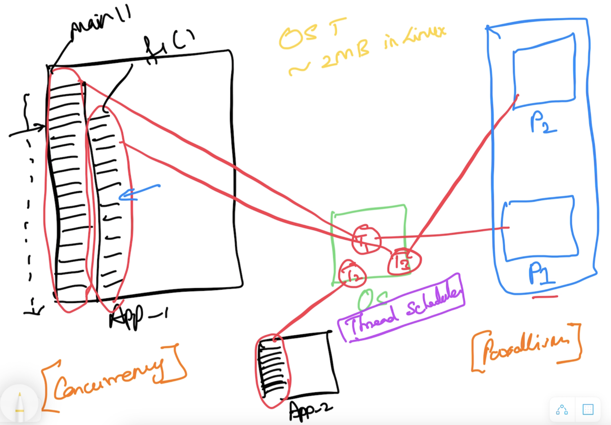
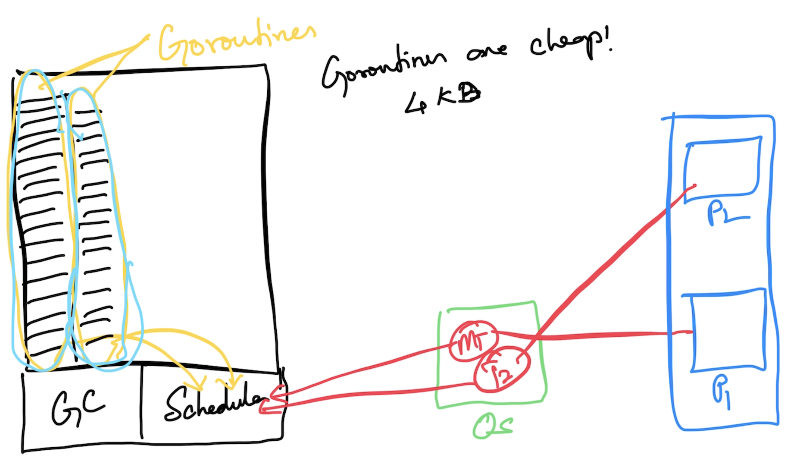

# Go Foundation

## Magesh Kuppan
- tkmagesh77@gmail.com
- https://www.linkedin.com/in/tkmagesh

## Schedule
- Commence      : 9:00 AM
- Tea Break     : 10:40 AM (20 mins)
- Lunch Break   : 12:30 PM (1 hour)
- Tea Break     : 03:00 PM (20 mins)
- Wind up       : 04:30 PM 

## Methodolgy
- No powerpoint presentations
- Discuss & Code
- No dedicated time for Q & A (the floor is open at all times)

## Software Requirements
- Go Tools (https://go.dev/dl)
    - Verification
        ```
        $ go version
        ```
- Any Editor (Visual Studio Code)

## Repository
- https://github.com/tkmagesh/cisco-go-jul-2024

## Why Go?
- Simplicity
    - ONLY 25 keywords
    - No access modifiers (public/private/protected etc)
    - No reference types (everything is a value in go)
    - No pointer arithmatic 
    - No classes (only structs)
    - No inheritance (only compostion)
    - No execptions (only errors)
    - No try..catch..finally construct
    - No implicit type conversions
- Managed Concurrency
    - Concurrency Programming
        - Application with more than one execution path
        - Typically achieved by creating multiple OS threads
        - OS thread management is taken care by the OS thread scheduler
        
    - Builtin Scheduler
    

    - lightweight goroutines (~4KB)
    - Concurrency features are built in the language
        - go keyword, channel (chan) data type, channel operator ( <- ), range , select-case
        - Standard Library APIs
            - "sync" package
            - "sync/atomic" packages

- Close to hardware
    - Compile to machine code
    - Less startup time
    - One build per deployment platform 
    - Builtin tooling support for cross-compilation

## Program Structure

### Compile a go program
```
go build [file_name.go]
```
```
go build -o [binary_name] [file_name.go]
```

### Compile & Execute
```
go run [file_name.go]
```

### Cross Compilatation
#### To get the list of go tool specific environment variables
```
go env
```
#### Environment variables related to cross compilation
- GOOS
- GOARCH
```
go env GOOS GOARCH
```
#### To change the environment variables
```
go env -w [env_var_1]=[val_1] [env_var_2]=[val_2]
```
#### To get the list of supported platforms
```
go tool dist list
```
#### To cross compile
```
GOOS=[target_os] GOARCH=[target_arch] go build [file_name.go]
```
ex:
```
GOOS=windows GOARCH=amd64 go build 01-hello-world.go
```

## Data Types
- string
- bool
- integers
    - int8
    - int16
    - int32
    - int64
    - int
- unsigned integers
    - uint8
    - uint16
    - uint32
    - uint64
    - uint
- floating points
    - float32
    - float64
- complex
    - complex64 ( real[float32] + imaginary[float32] )
    - complex128 ( real[float64] + imaginary[float64] )
- alias
    - byte (alias for unnsigned int)
    - rune (alias for unicode code point)

### Zero values
| Data Type | Zero value |
------------ | ------------- |
|int family     | 0 |
|uint family    | 0 |
|complex family | (0+0i) |
|string         | "" (empty string) |
|bool           | false |
|byte           | 0 |
|interface      | nil |
|pointer        | nil |
|function       | nil |
|struct         | struct instance |

## Variable Declaration
- using 'var' keyword
- using ':='

### Scope
#### Function Scope
- Can use := to declare & initialize variables
- CANNOT have unused variables

#### Package Scope
- CANNOT use :=
- Can have unused variables

## Functions
- Functions can return more than 1 result
- Variadic functions
- Anonymous functions
    - functions defined in another function
    - cannot have a name
    - have to be immediately invoked
- Higher Order Functions
    - Assign functions as values to variables
    - Pass function as an argument to other functions
    - Return functions as return values

## Collections
### Array
- Fixed sized typed collection
### Slice
### Map